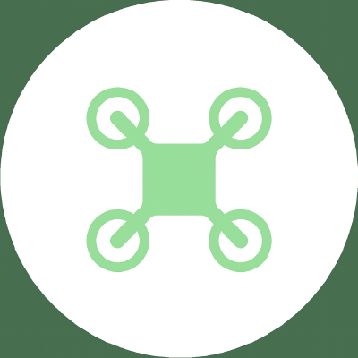

# [CPA] Crazyflie 2.x

This repository provides a cyber-physical representation of the **Crazyflie 2.x drone**, positioning it as an asset within the **Industry 4.0 ecosystem**. 

The resources here enable integration, simulation, and control of Crazyflie 2.x in both physical and virtual environments.

## Features

The repository includes the following components:

1. **Standalone High-Level Controller**:
   - A Terminal-based Controller for the Crazyflie 2.X as a WebService (both physical and simulated instances).
   - See [cf.PyControl](https://github.com/UniAgent-CyberPhysicalAssets/cps.asset.crazyflie/tree/main/controller/cf.PyControl)
2. **Simulation Environments**:
   - Support: [ds-crazyflie](simulation/ds-crazyflies-ext), [sim_cf2](simulation/sim_cf2-ext) and [crazyswarm2](simulation/crazyswarm2-ext)

## Software Stack

This CPS asset relies on the following software stack:

- Python 3.10.12+ for the standalone high-level controller
- ROS Humble/Jazzy or later for simulation environments
- BaSyx Middleware for implementing the AAS (WIP)

Most components are provided as Docker containers for a quick start.

## Tutorial

For detailed instructions on how to set up and use this CPS asset,
please refer to the [documentation](https://uniagent-cyberphysicalassets.github.io/cps.asset.crazyflie/).

## Outlook 

### Digital Twin

Development of the drone's digital twin is ongoing and will evolve as the relevant standards mature.

- **Asset Administration Shell (AAS):**
    A representation of the Crazyflie 2.x using Eclipse BaSyx Industrie 4.0 middleware. Multiple submodels will describe drone properties such as available actions, payload capacity, and physical characteristics.

- **Behavioral Runtime Model:**
    An executable Bigraphical Reactive System specification will simulate runtime behavior within cyber-physical environments.

> [!NOTE] 
> 
> This feature is under development and subject to change based on the finalization of AAS submodel standards:
> - Submodel Template: Unmanned aerial vehicle (Drone)
> - IDTA Number: 02081
> 
> See [here](https://industrialdigitaltwin.org/content-hub/teilmodelle) for more details.

## License

See each component's license file for details.

---

Copyright © 2025 The UniAgent Developers and Contributors.