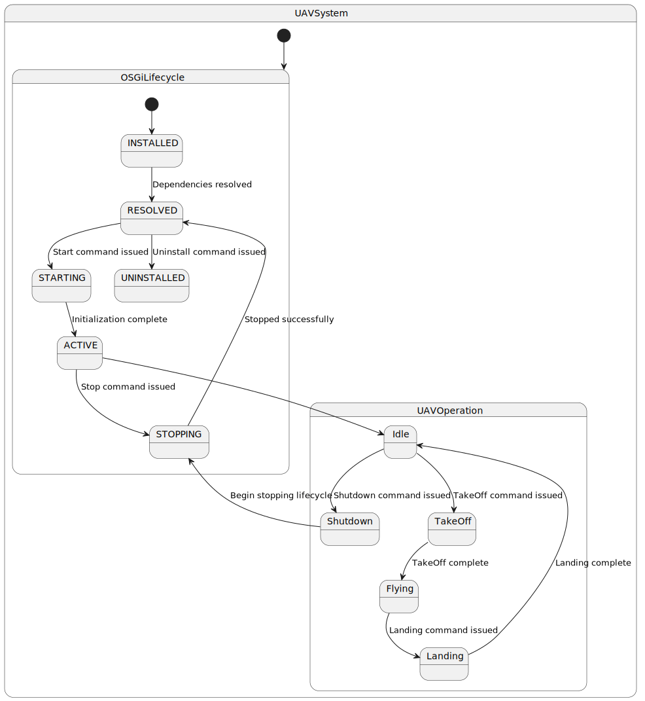

# Local Workspace Setup: cf.PyControl

This document describes how to set up the development environment for cf.PyControl.

## System Prerequisites

**Tested with:**

- Ubuntu 24.04 (6.8.0-39-generic)
- Python 3.12.3
- Crazyflie 2.x
- ROS2 Humble, Jazzy

### Install System Packages

```shell
$ sudo apt install git graphviz
$ sudo apt install python3-pip python3-virtualenv libxcb-xinerama0 libxcb-cursor0
```

### Install ROS2

> [!IMPORTANT]
> These steps are required if you want to use crazyswarm2 or ds-crazyflie.

- Follow the official installation instructions for your platform (Humble/Jazzy): https://docs.ros.org/en/jazzy/

- Install DDS (Humble/Jazzy):
```shell
$ sudo apt-get install -y ros-${ROS_DISTRO}-rmw-cyclonedds-cpp
export RMW_IMPLEMENTATION=rmw_cyclonedds_cpp
```

- Make sure the ROS environment is sourced: `source /opt/ros/${ROS_DISTRO}/setup.bash`

### USB Permissions

- _(Only under Linux)_
To use Crazyradio and Crazyflie 2 over USB without being root: [USB permissions ](https://www.bitcraze.io/documentation/repository/crazyflie-lib-python/master/installation/usb_permissions/)

## Workspace Setup

### Create Virtual Environment

Create and activate the virtual environment:

```shell
$ python3 -m venv venv # or: virtualenv venv 
$ source venv/bin/activate
```

### Install Python Packages

> [!IMPORTANT]
> The first option is the recommended way of installing the Crazyflie libraries.
> Manual installation is just for demonstration purposes.

- Install Packages from [`requirements.txt`](requirements.txt):

```shell
$ pip3 install -r requirements.txt
```

### Install ROS2 Support

**For ds-crazyflie simulator:**
- Make sure ROS2 is sourced
- Install ds-crazyflie message packages and source them:

```shell
$ colcon build --packages-select crazyflie_interfaces crazyflie_webots_gateway_interfaces
$ source ./install/setup.bash
```

### FAQ

**Manual Installation (cflib, cfclient):**

To use the latest release of the cfclient and cflib, you can directly clone both repositories and install them in the
virtual environment:

```shell
git clone https://github.com/bitcraze/crazyflie-lib-python.git
git clone https://github.com/bitcraze/crazyflie-clients-python

cd crazyflie-lib-python
pip3 install -e .
cd ..
cd crazyflie-clients-python
pip install -e .
```

You have to install the required python libraries yourself. See `requirements.txt` for the respective versions.

## Drone Software Controller Specification

A state machine is a model that describes the behavior of the Crazyflie 2.X using the notion of states and transitions.
Each transition is labeled with an action.
Thus, each transition maps to an action, which represents and implements the specific low-level code of the cflib Python
library for this specific state and transition of the drone.

The version of the state machine employed in cf.PyControl can be used for many use cases.

**Visualisation**

| Figure                                                                            | PlantUML                                                                                                                                                                                                                                                                                                                                                                                                                                                                                                                                                                                                                                                                                                                                                                                                                                                                                                                                        |
|-----------------------------------------------------------------------------------|-------------------------------------------------------------------------------------------------------------------------------------------------------------------------------------------------------------------------------------------------------------------------------------------------------------------------------------------------------------------------------------------------------------------------------------------------------------------------------------------------------------------------------------------------------------------------------------------------------------------------------------------------------------------------------------------------------------------------------------------------------------------------------------------------------------------------------------------------------------------------------------------------------------------------------------------------|
|  | @startuml<br/><br/><br/>state UAVSystem {<br/>    [*] --> OSGiLifecycle<br/>    state OSGiLifecycle {<br/>        [*] --> INSTALLED<br/>        INSTALLED --> RESOLVED : Dependencies resolved<br/>        RESOLVED --> STARTING : Start command issued<br/>        STARTING --> ACTIVE : Initialization complete<br/>        ACTIVE --> STOPPING : Stop command issued<br/>        STOPPING --> RESOLVED : Stopped successfully<br/>        RESOLVED --> UNINSTALLED : Uninstall command issued<br/>    }<br/><br/>    state UAVOperation {<br/>        Idle --> TakeOff : TakeOff command issued<br/>        TakeOff --> Flying : TakeOff complete<br/>        Flying --> Landing : Landing command issued<br/>        Landing --> Idle : Landing complete<br/>        Idle --> Shutdown : Shutdown command issued<br/>        Shutdown --> STOPPING : Begin stopping lifecycle<br/>    }<br/><br/>    ACTIVE --> Idle<br/>}<br/><br/>@enduml |

### Design Aspects

- UAV System (Parent State) contains two interrelated orthogonal regions
- They manage the software lifecycle and the physical state of the UAV

**Explanation of Transitions**

1. **OSGi Lifecycle**: This region manages the states related to the UAV's software bundle lifecycle.
    - Transitions between **INSTALLED**, **RESOLVED**, **STARTING**, **ACTIVE**, **STOPPING**, and **UNINSTALLED**
      follow the OSGi lifecycle.
2. **UAV Operation**: This region manages the physical state of the UAV.
    - **Idle** to **TakeOff**: Triggered by a takeoff command.
    - **TakeOff** to **Flying**: Occurs when the takeoff is complete.
    - **Flying** to **Landing**: Triggered by a landing command.
    - **Landing** to **Idle**: Occurs when the landing is complete.

### uav.OSGiLifecycle: Drone Software Bundle Life-cycle (Region)

##### States

The OSGi (Open Services Gateway initiative) lifecycle states for bundles typically include:

1. **INSTALLED**: The bundle has been successfully installed.
    1. Means: The UAV software bundle is installed but not yet resolved.; The service is generally available, cflib
       installed, is Java available, ROS Etc.
2. **RESOLVED**: All necessary dependencies have been resolved.
    1. Means: The UAV software dependencies are resolved, and it is ready to be started; the dependency requirements are
       checked, version compatability etc, and when required is updated.
3. **STARTING**: The bundle is in the process of starting.
    1. Means: The UAV is initializing; the required Decks are available; battery is checked; propellers etc.; Use-case
       specific pre-starting procedure; Logging; default noise measurement for static position (a simple heuristic is
       used to determine if the drone is flying based on acceleration)
4. **ACTIVE**: The bundle is running and active.
    1. Means: The UAV is fully operational; Logging (print last checkup values), Use-case specific pre-starting
       procedure;
    2. transition initializes: prepares logging of values, prepares ROS2 messages, etc too
5. **STOPPING**: The bundle is in the process of stopping.
6. **UNINSTALLED**: The bundle has been uninstalled.

##### Transitions

- **INSTALLED** --> **RESOLVED**: Dependencies resolved
- **RESOLVED** --> **STARTING**: Start command issued
- **STARTING** --> **ACTIVE**: Initialization completes; webserver started, rest interface ready, logging ros setup
- **ACTIVE** --> **STOPPING**: Stop command issued
- **STOPPING** --> **RESOLVED**: Stopped successfully
- **RESOLVED** --> **UNINSTALLED**: Uninstall command issued

### uav.Operation: Drone-Specific Operation Life-cycle (Region)

##### States

In addition to these, we'll introduce UAV-specific states for operational control:

1. **IDLE**: The UAV is powered on, health checks are fine, battery is full, but motors not yet active. It is on the
   ground
2. **HOVERING**: The UAV is in the air and operational. the UAV is hovering at specific height // The UAV is in the
   process of taking off.
3. **FLYING**: The UAV is flying a manouvur or navigating to a goal, or follows a movement/swarm pattern.
4. **LANDED**: The UAV has landed after being in the process of landing.

- **Idle**: Start or End; Continuous states; loops here; Landing complete; or any other previous task was completed
- **HOVERING**: Command to take off issued; Continuous states; loops here
- **Flying**: Take off completeM Continuous states; loops here
- **Landing**: Command to land issued; Continuous states; loops here

[//]: # (##### Transitions)

