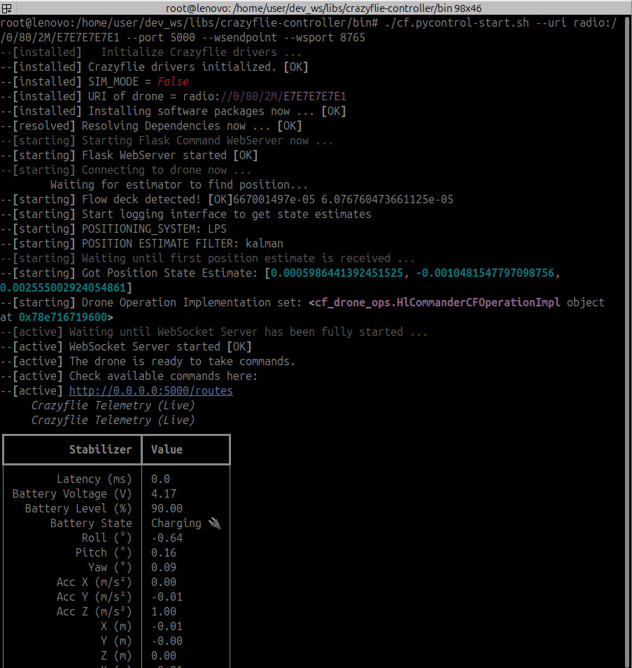

# cf.PyControl: A Terminal-based RESTful Controller for the Crazyflie 2.X

**cf.PyControl** is a Terminal-based **Web Service** written in **Python** for the **Crazyflie 2.X** used in combination with the **FlowDeck** and/or the **Loco Position System (LPS)**.

The high-level actions of the drone are internally managed by a *StateChart* and can be triggered via *web endpoints*.

----

Technically, this service implements the *state machine pattern* to model and execute basic drone operations such as **TakeOff**, **Landing**, **Navigate**, BatteryCheck, MotorCheck, and so forth. The state machine, i.e., the drone actions, is accessible via a RESTful API (see [Overview](#overview)), which makes it easy to integrate cf.PyControl with other systems or user interfaces. 
Here, the state machine of the Crazyflie 2.X is specified as described in ["Drone Software Controller Specification"](Development.md#drone-software-controller-specification). 
Note that this is a custom design choice. 
It is general enough to be used in different use cases and applications.

----

**tl;dr;**

- cf.pycontrol-start.sh --uri radio://0/80/2M/E7E7E7E7E1 --port 5000
- cf.pycontrol-start.sh --uri radio://0/80/2M/E7E7E7E7E1 --port 5000 --wsendpoint --wsport 8765
- cf.pycontrol-start.sh --uri radio://0/80/2M/E7E7E7E7E2 --port 5001
- cf.pycontrol-start.sh --uri radio://0/80/2M/E7E7E7E7E3 --port 5002
- curl -d {} http://127.0.0.1:5000/activate_idle && curl -d {} http://127.0.0.1:5001/activate_idle && curl -d {} http://127.0.0.1:5002/activate_idle
- curl -d {} http://127.0.0.1:5000/begin_takeoff
- curl -d {} http://127.0.0.1:5000/begin_landing

**Screenshot**



## Installation

> [!NOTE]
>
> - Start quickly using the Docker image — see [Container-Setup.md](Container-Setup.md).
>
> - Otherwise, see [Development.md](Development.md) for instructions on setting up the local workspace for cf.PyControl and getting started with development.

## Getting Started

> [!NOTE]
>
> This example doesn’t directly control the Crazyflie 2.x — it’s a quick demo to illustrate the intended usage.

Start the Crazyflie control service with the following argument:

```shell
$ cf.pycontrol-start.sh --debug --uri radio://0/80/2M/E7E7E7E7E1
```

The shell script is located in the `bin` folder.

> [!NOTE]
>
> You may need to update the radio URI.
>
> The default is usually: `radio://0/80/2M/E7E7E7E7E1`
>
> For details, see the standard setup guide at [bitcraze.io](https://www.bitcraze.io/).

Open the `webview.html` in the `webview` folder to see the state machine updating live.

Therefore, open another terminal and change the states (or, run another Docker container):

```shell
$ curl http://127.0.0.1:5000/status
$ curl -d {} http://127.0.0.1:5000/activate_idle
$ curl http://127.0.0.1:5000/status
```

Now, view the live state machine overview in your browser.

The following sections:
  - Explain available drone actions via the REST API
  - Describe advanced use cases
  - Show how to configure the service

## Basic Operations

#### Activate the Drone

This is usually the <u>first command</u> you need to run to allow the Crazyflie to fly.

The security lock is released that prevents accepting commands right after the drone was switched on.

```shell
curl -d {} http://127.0.0.1:5000/activate_idle
```

#### Drone Mission: NavigateToTarget (x,y,z)

```shell
curl -X post http://127.0.0.1:5000/navigate/x/y/z
```

Example:

```shell
curl -X post http://localhost:5000/navigate/1.0/1.0/0.5
```

Moves to `(1, 1, 0.5)` from the current position and then hovers.

Ensure you have enough space.

- With the Flow deck, the initial position is approximately `(0, 0, 0)` on the ground.
- With LPS, the initial position depends on the LPS node system’s origin and the drone’s placement.

You can use either the `kalmanEstimate` or `stateEstimate` to obtain the position.
 Accuracy depends on the positioning system in use—both LPS and Flow deck support this.

## Composed Operations

#### TakeOff - and - Landing

- You can initiate the simple drone mission "TakeOff-Landing" as follows by composing HTTP POST requests in a row (order is important)

```shell
curl -d {} http://127.0.0.1:5000/activate_idle && \
curl -d {} http://127.0.0.1:5000/begin_takeoff && \
curl -d {} http://127.0.0.1:5000/begin_landing
```

#### NavigateToGoal - and - Landing

```shell
curl -d {} http://127.0.0.1:5000/activate_idle && \
curl -d {} http://127.0.0.1:5000/begin_takeoff && \
curl -d {} http://localhost:5000/navigate/0.2/0.2/0.6 && \
curl -d {} http://127.0.0.1:5000/begin_landing
# And back
curl -d {} http://127.0.0.1:5000/activate_idle && \
curl -d {} http://127.0.0.1:5000/begin_takeoff && \
curl -d {} http://localhost:5000/navigate/0.0/0.0/0.4 && \
curl -d {} http://127.0.0.1:5000/begin_landing
```

#### Navigate to multiple separated goals, each interrupted by a short hovering, and land

- 4 target positions: 

- Hovering->Flying-Hovering->Flying->Hovering->Flying-Hovering->Flying->Hovering->Landed

```shell
curl -X post http://127.0.0.1:5000/activate_idle && \
curl -X post http://127.0.0.1:5000/begin_takeoff && \
curl -X post http://127.0.0.1:5000/navigate/0.3/0.0/0.4 && \
curl -X post http://127.0.0.1:5000/navigate/0.0/0.0/0.4 && \
curl -X post http://127.0.0.1:5000/navigate/0.0/0.3/0.4 && \
curl -X post http://127.0.0.1:5000/navigate/0.0/0.0/0.4 && \
curl -X post http://127.0.0.1:5000/begin_landing
```

- Each target is represented as one Flying state

#### Navigate a path of multiple goals without pause, and land

```shell
curl -X post http://127.0.0.1:5000/activate_idle && \
curl -X post http://127.0.0.1:5000/begin_takeoff && \
curl -X post http://127.0.0.1:5000/navigate/append/0.3/0.3/0.6
curl -X post http://127.0.0.1:5000/navigate/append/0.2/0.2/0.6
curl -X post http://127.0.0.1:5000/navigate/append/0.1/0.1/0.6
curl -X post http://localhost:5000/navigate/0.0/0.0/0.4 && \
curl -X post http://127.0.0.1:5000/begin_landing
```

**Hovering → Flying → Landed**

All targets are managed within a single Flying state.

Coordinates are appended to the drone’s navigation queue.
 These targets are processed when calling the `/navigate/x/y/z` endpoint, similar to posting the full JSON coordinate object described earlier.

- The first POST to the navigation endpoint sets the initial goal.
- Subsequent POSTs update the final target coordinate.

Using this consecutive approach, you’ll notice the drone hovers briefly upon reaching each target before proceeding to the next—effectively “idling” between waypoints.

```shell
curl -X post http://127.0.0.1:5000/activate_idle && \
curl -X post http://127.0.0.1:5000/begin_takeoff && \
curl -X post http://localhost:5000/navigate/0.3/0.3/0.6 && \
curl -X post http://localhost:5000/navigate/0.0/0.0/0.4 && \
curl -X post http://127.0.0.1:5000/begin_landing
```


## Controller Configuration

Change Port:

- use --port for web server (UAV operations)
- use --wsport for web socket server that publishes state information about the drone (e.g., position)

[//]: # (Change Name of drone &#40;important for multi-UAV scenarios&#41;: )

Mode: 

- `--sim` when using with sim_cf2
- `--debug` for more debug and verbose output in the terminal

## Error Handling

If the state machine cannot start, this can have several reasons:

- Your system environment is incomplete (e.g., missing packages) or not suited for this library (e.g., unsupported OS)
- The Crazyflie 2.x itself reports problems (perform a health check, battery/propeller test, check Crazyflie Radio USB)

What usually helps is the following:

- Try to disconnect crazyflie, Crazyradio first. Then reconnect the antenna first to the host computer, then connect CF via usb, switch it on, start the cfclient and try to connect, check battery and then disconnect. Switch off the Crazyflie and unplug the USB from it. 
- Place the Crazyflie somewhere with enough space, switch it on, then start the controller again.

