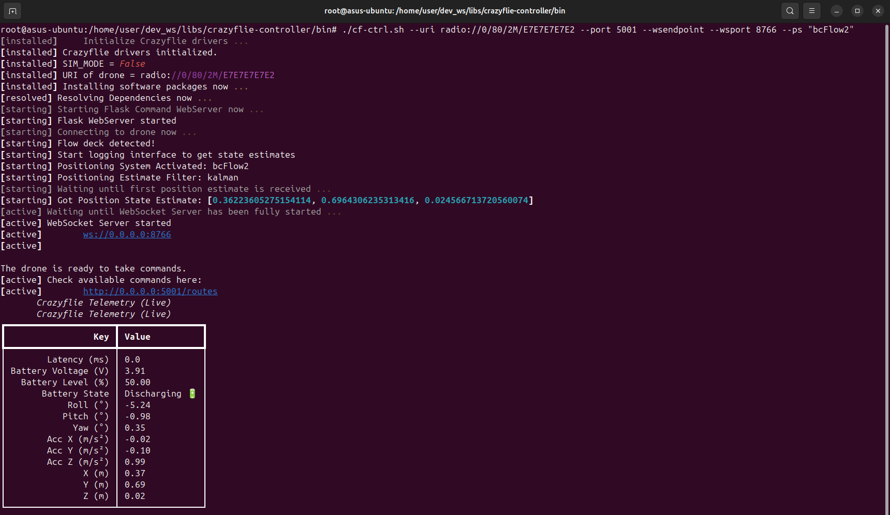

# cf.PyControl

**cf.PyControl** is a Terminal-based **WebService** written in **Python** for the **Crazyflie 2.X** used in combination with the **FlowDeck** and/or the **Loco Position System (LPS)**.

The high-level actions of the drone are internally managed by a [*State Machine*](Development.md#drone-software-controller-specification) and can be triggered via [*Web Endpoints*](#basic-operations).

**Features**
- Supported Actions: TakeOff, Landing, Navigate
- Controller:
  - Hardware control
  - sim_cf2 simulation mode
  - ds-crazyflie simulation mode
- WebView (Live State Updates)

**Screenshot**



## Installation

> [!NOTE]
>
> (For End-users) Start quickly using the Docker image: [Container-Setup.md](Container-Setup.md).
>
> (For Developers) For instructions on setting up the local workspace for cf.PyControl and getting started with development: [Development.md](Development.md).

## tl;dr;

- **Start**
  - Connect the Crazyradio 2.0 to a USB port
  - Switch on the Crazyflie 2.X drone
  - Start the Crazyflie Client (Test): `cfclient`
  
- **Webserver and Websocket Ports**
  - ./cfpyctrl.sh --uri radio://0/80/2M/E7E7E7E7E1 --port 5000
  - ./cfpyctrl.sh --uri radio://0/80/2M/E7E7E7E7E1 --port 5000 --wsendpoint --wsport 8765

- **Positioning System**
  - ./cfpyctrl.sh --uri radio://0/80/2M/E7E7E7E7E2 --port 5001 --ps "bcFlow2" # default
  - ./cfpyctrl.sh --uri radio://0/80/2M/E7E7E7E7E2 --port 5001 --ps "LPS"
  - ./cfpyctrl.sh --uri radio://0/80/2M/E7E7E7E7E2 --port 5001 --ps "LPS|bcFlow2"

- **Flight Operations**
  - curl -d {} http://127.0.0.1:5000/activate_idle && curl -d {} http://127.0.0.1:5001/activate_idle
  - curl -d {} http://127.0.0.1:5000/begin_takeoff
  - curl -d {} http://127.0.0.1:5000/begin_landing

- **Simulation Mode** _(requires running Simulator)_
  - ds-crazflie:
    - ./cfpyctrl.sh --dscf --cf-prefix /cf0 --wsendpoint
    - ./cfpyctrl.sh --dscf --cf-prefix /cf1 --port 5001 --wsendpoint --wsport 8766
  - sim_cf2:
    - ./cfpyctrl.sh --uri radio://0/80/2M/E7E7E7E701 --wsendpoint --sim
    - ./cfpyctrl.sh --uri radio://0/80/2M/E7E7E7E702 --port 5001 --wsendpoint --wsport 8766 --sim


## Getting Started

> [!NOTE]
>
> This example doesn’t directly control the Crazyflie 2.x. It’s a quick demo to illustrate the intended usage.

Start the Crazyflie control service with the following argument:

```shell
$ ./cfpyctrl.sh --debug --uri radio://0/80/2M/E7E7E7E7E1
```

`cfpyctrl.sh` is a convenient startup shell script located in the `bin` directory. 
It simplifies the process of running the main Python service script by handling arguments and execution.

> [!NOTE]
>
> You may need to update the radio URI.
>
> The default is usually: `radio://0/80/2M/E7E7E7E7E1`
>
> For details, see the standard setup guide at [bitcraze.io](https://www.bitcraze.io/).

Open the `webview.html` in the `webview` folder to see the state machine updating live.

Therefore, open another terminal and change the states (or, run another Docker container):

```shell
$ curl http://127.0.0.1:5000/status
$ curl -d {} http://127.0.0.1:5000/activate_idle
$ curl http://127.0.0.1:5000/status
```

Now, view the live state machine overview in your browser.

The following sections:
  - Explain available drone actions via the REST API
  - Describe advanced use cases
  - Show how to configure the service

## Basic Operations

Technically, this service implements the *state machine pattern* to model and execute basic drone operations such as **TakeOff**, **Landing**, **Navigate**, and so forth. 
The drone actions are accessible via a RESTful API, which makes it easy to integrate cf.PyControl with other systems or user interfaces. 
The state machine of the Crazyflie 2.X in cf.PyControl is specified as described in ["Drone Software Controller Specification"](Development.md#drone-software-controller-specification). 
Note that this is a custom design choice. 
It is general enough to be used in different use cases and applications.

**Before You Start**

When running cf.PyControl for the first time or after a long time, it's recommended to verify that your Crazyflie setup is working correctly:
- Connect the Crazyradio PA 2.0 to a USB port on your computer.
- Power on the Crazyflie 2.X drone.
- Launch the Crazyflie Client inside the Docker container to test the connection: `cfclient`
- Confirm that the drone connects and functions as expected within the client.
- Once verified, close the client and proceed with the rest of this section.


### Activate the Drone

This is usually the <u>first command</u> you need to run to allow the Crazyflie to fly.

The security lock is released that prevents accepting commands right after the drone was switched on.

```shell
curl -d {} http://127.0.0.1:5000/activate_idle
```

### Begin Takeoff

```shell
$ curl -d {} http://127.0.0.1:5000/begin_takeoff
```

Initiates the takeoff sequence for the Crazyflie.
The controller will command the Crazyflie to ascend to its default takeoff altitude and stabilize in hover mode before awaiting further mission commands.

- DEFAULT_HEIGHT = 0.5cm
- DEFAULT_VELOCITY = 0.3
- Modify Parameter: [`src/cf_drone_ops.py`](src/cf_drone_ops.py)

### Begin Landing

```shell
$ curl -d {} http://127.0.0.1:5000/begin_landing
```

Initiates the landing sequence for the Crazyflie.

### NavigateToTarget (x,y,z)

```shell
curl -d {} http://127.0.0.1:5000/navigate/x/y/z
```

Example:

```shell
curl -d {} http://localhost:5000/navigate/1.0/1.0/0.5
```

Moves to `(1, 1, 0.5)` from the current position and then hovers.

Ensure you have enough space.

- With the Flow deck, the initial position is approximately `(0, 0, 0)` on the ground, when the drone is started.
- With LPS, the initial position depends on the LPS node system’s origin and the drone’s placement.

> **Note:**
> You can use either the `kalmanEstimate` or `stateEstimate` to obtain the position.
> Accuracy depends on the positioning system in use (both LPS and Flow deck support this).
> This can be changed in `cf-ctrl-service.py` by changing the global variable `POSITION_ESTIMATE_FILTER`.

### Drone State Updates via WebSocket Endpoint

With [websocat](https://github.com/vi/websocat) installed on your system, you can use the following command to test the WebSocket endpoint of cf.PyControl:
```shell
$ websocat ws://localhost:8765
```

It provides you with live updates of the drone’s state (e.g., position).
Some output will be also visible in the terminal where cf.PyControl is running.

Therefore, the controller must be started with the `--wsendpoint --wsport 8765` flag.
The last argument is the port of the WebSocket endpoint, which can be changed.

### Live State Update via WebView

> This assumes that you have build the Docker image and started the container: [Container-Setup.md](Container-Setup.md).

First, check that the host has the directory for the shared data configured: `mkdir -p shared`.

Second, find out the container name:

```shell
$ docker ps --filter "ancestor=cf-pyctrl:latest" --format "{{.ID}}"
8205624872ec
7f39caff4dbd
[...]
```

Select one of the possible outputs. 
There is one ID per running Docker container.

Then, execute the following shell script inside the `shared` folder for convenience:
```shell
# Change Folder
$ cd shared
# Make Executable
$ chmod +x ./sync-webview.sh

# Show Usage
$ ./sync-webview.sh
Usage: ./sync-webview.sh <container_id_or_name> [--verbose]

Arguments:
  <container_id_or_name>   Name or ID of the Docker container
  --verbose                Enable verbose output (shows docker cp output)

# Example  
$ ./sync-webview.sh 8205624872ec
$ ./sync-webview.sh --verbose 8205624872ec 
```

This script uses a loop that periodically copies data from container to host.

Change - in this example - into the `shared/8205624872ec/webview` folder of this project on your host system.
Open the `webview.html` in the browser to the see the drones status.

For each container, a separate folder is created on the host to enable live updates of each drone's internal state machine for parallel monitoring and debugging purposes.

## Composed Operations

#### TakeOff - and - Landing

- You can initiate the simple drone mission "TakeOff-Landing" as follows by composing HTTP POST requests in a row (order is important)

```shell
curl -d {} http://127.0.0.1:5000/activate_idle && \
curl -d {} http://127.0.0.1:5000/begin_takeoff && \
curl -d {} http://127.0.0.1:5000/begin_landing
```

#### NavigateToGoal - and - Landing

```shell
curl -d {} http://127.0.0.1:5000/activate_idle && \
curl -d {} http://127.0.0.1:5000/begin_takeoff && \
curl -d {} http://localhost:5000/navigate/0.2/0.2/0.6 && \
curl -d {} http://127.0.0.1:5000/begin_landing
# And back
curl -d {} http://127.0.0.1:5000/activate_idle && \
curl -d {} http://127.0.0.1:5000/begin_takeoff && \
curl -d {} http://localhost:5000/navigate/0.0/0.0/0.4 && \
curl -d {} http://127.0.0.1:5000/begin_landing
```

#### Navigate to multiple separated goals, each interrupted by a short hovering, and land

- 4 target positions: 

- Hovering->Flying-Hovering->Flying->Hovering->Flying-Hovering->Flying->Hovering->Landed

```shell
curl -d {} http://127.0.0.1:5000/activate_idle && \
curl -d {} http://127.0.0.1:5000/begin_takeoff && \
curl -d {} http://127.0.0.1:5000/navigate/0.3/0.0/0.4 && \
curl -d {} http://127.0.0.1:5000/navigate/0.0/0.0/0.4 && \
curl -d {} http://127.0.0.1:5000/navigate/0.0/0.3/0.4 && \
curl -d {} http://127.0.0.1:5000/navigate/0.0/0.0/0.4 && \
curl -d {} http://127.0.0.1:5000/begin_landing
```

- Each target is represented as one Flying state

#### Navigate a path of multiple goals without pause, and land

```shell
curl -d {} http://127.0.0.1:5000/activate_idle && \
curl -d {} http://127.0.0.1:5000/begin_takeoff && \
curl -d {} http://127.0.0.1:5000/navigate/append/0.3/0.3/0.6
curl -d {} http://127.0.0.1:5000/navigate/append/0.2/0.2/0.6
curl -d {} http://127.0.0.1:5000/navigate/append/0.1/0.1/0.6
curl -d {} http://localhost:5000/navigate/0.0/0.0/0.4 && \
curl -d {} http://127.0.0.1:5000/begin_landing
```

**Hovering → Flying → Landed**

All targets are managed within a single Flying state.

Coordinates are appended to the drone’s navigation queue.
 These targets are processed when calling the `/navigate/x/y/z` endpoint, similar to posting the full JSON coordinate object described earlier.

- The first POST to the navigation endpoint sets the initial goal.
- Subsequent POSTs update the final target coordinate.

Using this consecutive approach, you’ll notice the drone hovers briefly upon reaching each target before proceeding to the next—effectively “idling” between waypoints.

```shell
curl -X post http://127.0.0.1:5000/activate_idle && \
curl -X post http://127.0.0.1:5000/begin_takeoff && \
curl -X post http://localhost:5000/navigate/0.3/0.3/0.6 && \
curl -X post http://localhost:5000/navigate/0.0/0.0/0.4 && \
curl -X post http://127.0.0.1:5000/begin_landing
```


## Controller Configuration

**Change Port:**

- use `--port` for web server (UAV operations)
- use `--wsport` for web socket server that publishes state information about the drone (e.g., position)

[//]: # (Change Name of drone &#40;important for multi-UAV scenarios&#41;: )

**Mode:** 

- `--sim` when using with sim_cf2
- `--debug` for more debug and verbose output in the terminal

**Positioning System:**

- use `--ps` to specify which positioning backend to use for the drone
- available options:
    - `"bcFlow2"` Flow deck–based optical positioning (default)
    - `"LPS"` Local Positioning System 
    - `"LPS|bcFlow2"` hybrid mode (uses both)

## Error Handling

If the state machine cannot start, this can have several reasons:

- Your system environment is incomplete (e.g., missing packages) or not suited for this library (e.g., unsupported OS)
- The Crazyflie 2.x itself reports problems (perform a health check, battery/propeller test, check Crazyflie Radio USB)

What usually helps is the following:

- Try to disconnect crazyflie, Crazyradio first. Then reconnect the antenna first to the host computer, then connect CF via usb, switch it on, start the cfclient and try to connect, check battery and then disconnect. Switch off the Crazyflie and unplug the USB from it. 
- Place the Crazyflie somewhere with enough space, switch it on, then start the controller again.

## License

**cf.PyControl** is Open Source software released under the Apache 2.0 license.

## Acknowledgment

This tool is developed and maintained by the UniAgent Developers and contributors:
- Thanks to Mikhail Belov for providing the initial version of this script and the webview for the internal state machine.
- Thanks to Tianxiong Zhang for continuous testing and feature requests.

---

Copyright © 2025 The UniAgent Developers and Contributors. <br/>
(Main Developer: Dominik Grzelak)