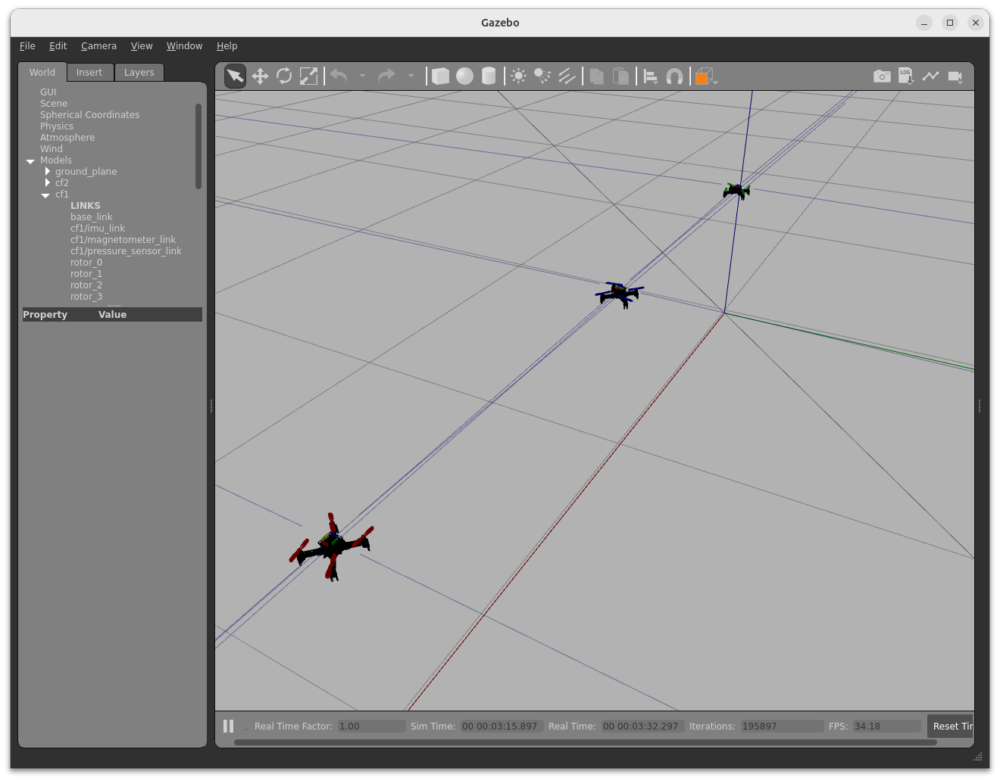

# Usage Guide: sim_cf2

This document assumes that sim_cf2 Docker container is already build on the host system.

- See [Container-Setup](./Container-Setup.md)




## Start Simulation

This example demonstrates how to configure and set up three drones (see configuration below).

```shell
# Run this command once to enable GUI display:
xhost +local:root

# Run this command in a fresh terminal to start each container:
sudo docker run --rm -it \
  --env ROS_DOMAIN_ID=30 --net=host --ipc=host --pid=host \
  --env DISPLAY \
  --volume /tmp/.X11-unix:/tmp/.X11-unix:rw \
  --volume "$(pwd)/.devcontainer/.bash_history:/root/.bash_history" \
  cf2_ros2_simu

# Command for Terminator Layout (Faster Setup)
trap $SHELL EXIT; xhost +local:root && sudo docker run --rm -it --env ROS_DOMAIN_ID=30 --net=host --ipc=host --pid=host --env DISPLAY --volume /tmp/.X11-unix:/tmp/.X11-unix:rw --volume "$(pwd)/.devcontainer/.bash_history:/root/.bash_history" cf2_ros2_simu /bin/bash -c "trap $SHELL EXIT;"
```

**Container Setup**

- Container 1:
  - `ros2 launch sim_cf2 main.launch.py use_sim_time:=True`
  - You can override the YAML configuration by specifying options via the command line:
    - `ros2 launch sim_cf2 main.launch.py x_cf1:=0.0 y_cf2:=0.0 use_sim_time:=True`
    - Note the drone prefix specified in the configuration file
- Container 2:
  - `cd /home/user/dev_ws/libs/crazyflie-firmware/scripts/sim_cf2`
  - `./run_cfs.sh 3`
- Container 3, 4, and 5 (as defined in YAML config file):
  - Container 3:
    - `cd /home/user/dev_ws/libs/crazyflie-controller/bin`
    - `./cf.pycontrol-start.sh --uri radio://0/80/2M/E7E7E7E701 --port 5000 --wsendpoint --wsport 8765 --sim`
  - Container 4: `./cf.pycontrol-start.sh --uri radio://0/80/2M/E7E7E7E702 --port 5001 --wsendpoint --wsport 8766 --sim`
  - Container 5`./cf.pycontrol-start.sh --uri radio://0/80/2M/E7E7E7E703 --port 5002 --wsendpoint --wsport 8767 --sim`
- Host or Container:
  - `curl -d {} http://127.0.0.1:5000/activate_idle`
    - or multi activation: `curl -d {} http://127.0.0.1:5000/activate_idle && curl -d {} http://127.0.0.1:5001/activate_idle && curl -d {} http://127.0.0.1:5002/activate_idle`
    - curl -d {} http://127.0.0.1:5000/activate_idle && curl -d {} http://127.0.0.1:5001/activate_idle && curl -d {} http://127.0.0.1:5002/activate_idle && curl -d {} http://127.0.0.1:5003/activate_idle
  - `curl -d {} http://127.0.0.1:5000/begin_takeoff`
    - multi: `curl -d {} http://127.0.0.1:5000/begin_takeoff && curl -d {} http://127.0.0.1:5001/begin_takeoff && curl -d {} http://127.0.0.1:5002/begin_takeoff`
  - `curl -d {} http://127.0.0.1:5000/navigate/1.0/1.0/0.4`
  - `curl -d {} http://127.0.0.1:5000/begin_landing`
    - multi: `curl -d {} http://127.0.0.1:5000/begin_landing && curl -d {} http://127.0.0.1:5001/begin_landing && curl -d {} http://127.0.0.1:5002/begin_landing`
  - Position Updates: `cd /home/user/dev_ws/libs/crazyflie-controller/test` and`./websocat ws://localhost:8765`

## Drone Configuration

The file is located in:

- (Host) `./sim_cf2/launch/crazyflies.yaml` 
- (Container) `/home/user/dev_ws/ros2/src/sim_cf2/launch/crazyflies.yaml` 

```yaml
robots:
  cf1:
    enabled: true
    uri: radio://0/80/2M/E7E7E7E7E1
    initial_position: [0.0, 0.0, 0.03]
    type: cf21
    color_prop_front: Green
    color_prop_back: Green
    tf_prefix: cf231
    enable_mr_deck: true
    mr_deck_visualize: true
    initial_orientation: 
      roll: 0.0
      pitch: 0.0
      yaw: 0.0

  cf2:
    enabled: true
    uri: radio://0/80/2M/E7E7E7E7E2
    initial_position: [1.0, 0.0, 0.03]
    type: cf21
    color_prop_front: Blue
    color_prop_back: Blue
    tf_prefix: cf232
    enable_mr_deck: true
    mr_deck_visualize: true
    initial_orientation: 
      roll: 0.0
      pitch: 0.0
      yaw: 0.0

  cf3:
    enabled: true
    uri: radio://0/80/2M/E7E7E7E7E3
    initial_position: [2.0, 0.0, 0.03]
    type: cf21
    color_prop_front: Red
    color_prop_back: Red
    tf_prefix: cf233
    enable_mr_deck: true
    mr_deck_visualize: true
    initial_orientation: 
      roll: 0.0
      pitch: 0.0
      yaw: 0.0

  cf4:
    enabled: false
    uri: radio://0/80/2M/E7E7E7E7E4
    initial_position: [2.0, 2.0, 0.03]
    type: cf21
    color_prop_front: Yellow
    color_prop_back: Yellow
    tf_prefix: cf234
    enable_mr_deck: true
    mr_deck_visualize: true
    initial_orientation: 
      roll: 0.0
      pitch: 0.0
      yaw: 0.0
```